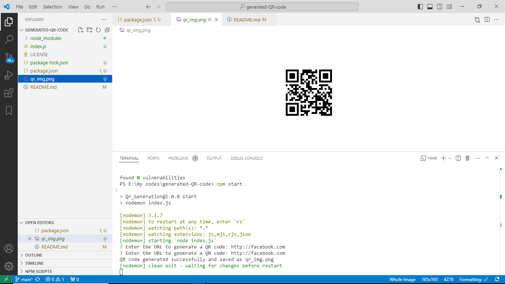

# generated-QR-code

This QR code generator, built with Node.js, enables you to create QR codes effortlessly for a variety of data types, including URLs, text, contact information, and more. Utilizing the powerful qrcode library, it simplifies the process, ensuring efficiency and ease of use.

Installation:

1. Install Node.js:
   Ensure you have Node.js installed on your system. If not, download and install it from the official site: https://nodejs.org/.

2. Clone or Download the Repository:
   Clone this repository to your local machine using Git or download the ZIP file and extract its contents.

3. Install Dependencies:
   Open a terminal, navigate to the project's root directory, and run the following command to install all required dependencies:

command to run

npm install
npm start

Enter Data:
When prompted, enter the data you want to encode into a QR code. This can be text, a URL, contact details, or any QR code-compatible data format.

Generate QR Code:
Once you press Enter, the program will generate a QR code image.

Access the QR Code:
The QR code image will be saved in the project directory with the name qr_img.png.

Example:
To generate a QR code for the URL https://www.facebook.com:

Start the QR code generator as described in the Usage section.
Enter the URL https://www.facebook.com when prompted and press Enter.
The QR code will be created and saved as qr_img.png in the project directory.
You can use the generated QR code for your projects, print it, or share it as needed.

**License:**

This QR code generator is released under the MIT License. Feel free to use and modify it for your own purposes. However, make sure to check the `LICENSE` file for more details.

For any issues or suggestions, please create an issue on the GitHub repository: [https://github.com/yash8107/generated-QR-code](https://github.com/yash8107/generated-QR-code)
